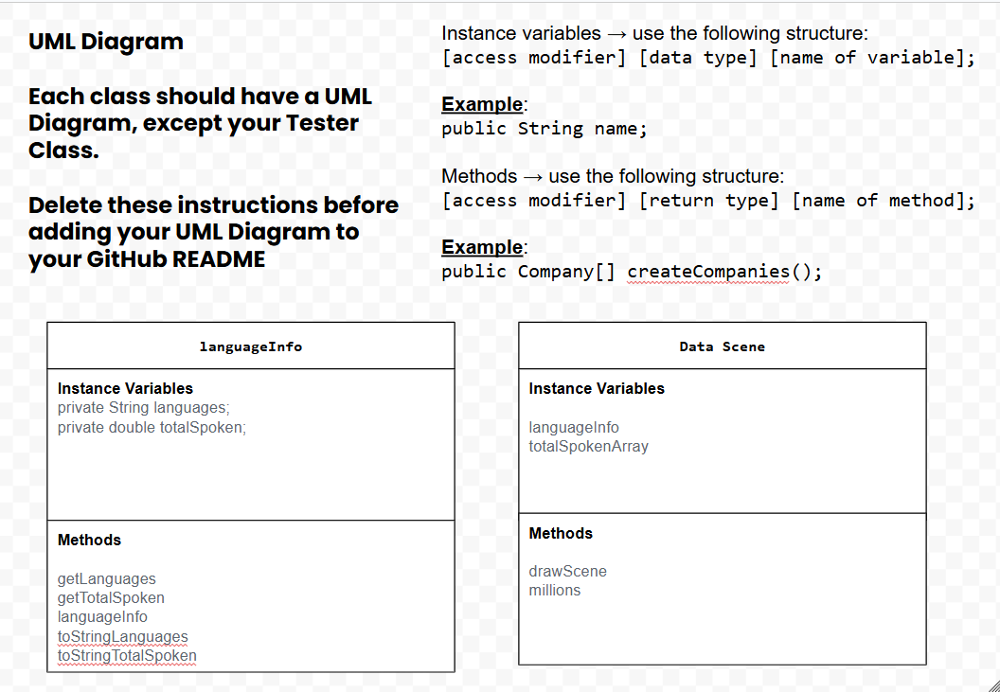
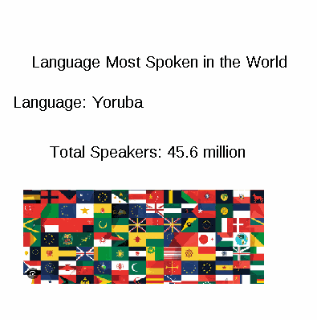

# Unit 4 - Abstract Art Project

## Introduction

Data visualizations are powerful tools to present information and convey patterns and relationships. Sometimes visualizations are charts or graphs, and other times they are more abstract pieces of art. Your goal is to create a visual representation relating at least two categories from your dataset that engages your viewer and encourages them to learn more about your chosen topic.

## Requirements

Use your knowledge of object-oriented programming, one-dimensional (1D) arrays, and algorithms to create your data visualization program:

- **Create at least two 1D arrays** – Create at least two 1D arrays to store the data that will make up your visualization.
- **Implement one or more algorithms** – Implement one or more algorithms that use two-way or multi-selection statements with compound Boolean expressions to analyze the data.
- **Use methods in the Math class** – Use one or more methods in the Math class in your program, such as to perform calculations on the values in your dataset and display the results, choose random values from the dataset, or display images or shapes at random locations.
- **Create a visualization** – Create an image or animation that conveys the story of the data by illustrating the patterns or relationships in the data.
  Note: This may be abstract! Others do not necessarily need to know what the story or pattern is right away, but you do need to be able to explain it to them.
- **Document your code** – Use comments to explain the purpose of the methods and code segments and note any preconditions and postconditions.

## Dataset

Dataset: https://www.kaggle.com/datasets/rajkumarpandey02/list-of-languages-by-total-number-of-speakers

- **Language** (String) - name of the language
- **Total People Speaking** (double) - total people speaking this language
## UML Diagram

UML Diagram for my project

## Video Demo

Thumbnail for my projet

Link to youtube video: (https://youtube.com/shorts/96_hkqTtSj4)

## Description

I used a dataset with the most spoken languages in the world. The code that I wrote generates a random language and gives the total number of speakers with that language by using 1D arrays. My goal for this project was to make users more aware of all the spoken languages and give them information about it. I used Math.random in order to randomize the country printed out in the animation.